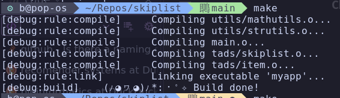
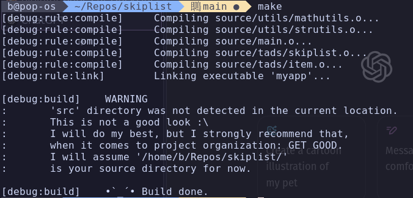

Here’s a draft for the README of your Makefile project:

---

# MasterMaker - A Simple Build System






---

## Overview

**MasterMaker** is a versatile and compact Makefile designed to simplify the compilation, building, and analysis process for small-to-medium C/C++ projects. It automatically handles debug and release modes, manages dependencies, and includes useful targets for building, running, cleaning, and even performing memory analysis with Valgrind. 

Whether you have a well-organized source structure or not, MasterMaker does its best to work smoothly, but it's highly recommended to follow a proper directory structure for optimal results.

This build system was initially created because my professor wouldn't allow me to use CMake for a project, so I designed my own. It was fun.

## Features
- **Automatic Dependency Management**: No need to worry about manually tracking dependencies.
- **Debug and Release Modes**: Choose between development (debug) or production (release) configurations.
- **Valgrind Analysis**: Easily perform memory analysis using Valgrind.
- **Dynamic Structure Handling**: Works even if your project is not perfectly organized but issues friendly warnings.
- **Quick Clean and Build**: Rebuild your project quickly and efficiently.
- **Friendly Messages**: The build process is accompanied by playful and helpful output messages.

---

## Recommended Project Structure

For best results, organize your project as follows:

```
your_project_name/
| src/
| | main.cpp
| | module_name/
| | | module_name.cpp/
| | | submodule_name_1.cpp/
| | | submodule_name_2.c/
| include/
| | module_name/
| | | module_name.hpp/
| | | submodule_name_1.h/
| | | submodule_name_2.hpp/
| Makefile
```

MasterMaker will automatically handle file imports using a simple `#include "module_name.hpp"`, with no need to specify full paths.

---

## Getting Started

### Prerequisites

You must use a Linux-based system for it to work. Also, you will need:

- **G++** (or any C/C++ compiler)
- **Make**
- **Valgrind** (For memory analysis, if you plan to use the `analysis` target)
- **ZIP utility** (For the `bundle` target, if you plan to package the project)

Additionally, mention that the necessary libraries can typically be installed via the system’s package manager. For example:

```bash
sudo apt-get install build-essential make valgrind zip
```

This way, users know how to install the necessary tools.


### Basic Commands

- **Build the project:**

  ```bash
  make build
  ```

- **Run the project:**

  ```bash
  make run
  ```

- **Clean build artifacts:**

  ```bash
  make clean
  ```

- **Fresh build (clean and build):**

  ```bash
  make fresh
  ```

- **Memory analysis using Valgrind:**

  ```bash
  make analysis
  ```

- **Get some help**

  ```bash
  make help
  ```

---

## Advanced Usage

### Build in Release Mode

By default, MasterMaker compiles in debug mode. To compile in release mode with optimizations, run:

```
make build RELEASE=true
```

### Create a Bundle

MasterMaker can bundle your project (excluding build artifacts and unnecessary files) into a `.zip` archive:

```bash
make bundle
```

---

## Special Targets

- **quick**: Quick clean, build, and run.
- **NUKE**: Completely deletes the target folder and all build artifacts.
- **hello**: A fun command to print a greeting.
- **help**: Displays all available targets and usage information.

---

## License

```
The MIT License (MIT)
© 2023 β
```

Feel free to modify and redistribute this software under the terms of the MIT License.

---

Let me know if you'd like to modify or add more details!